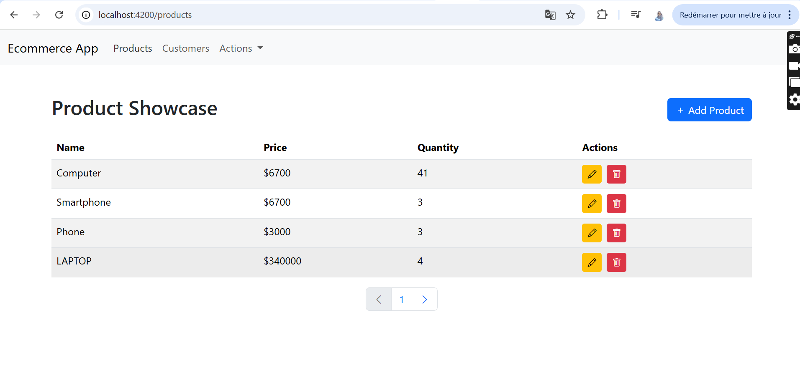
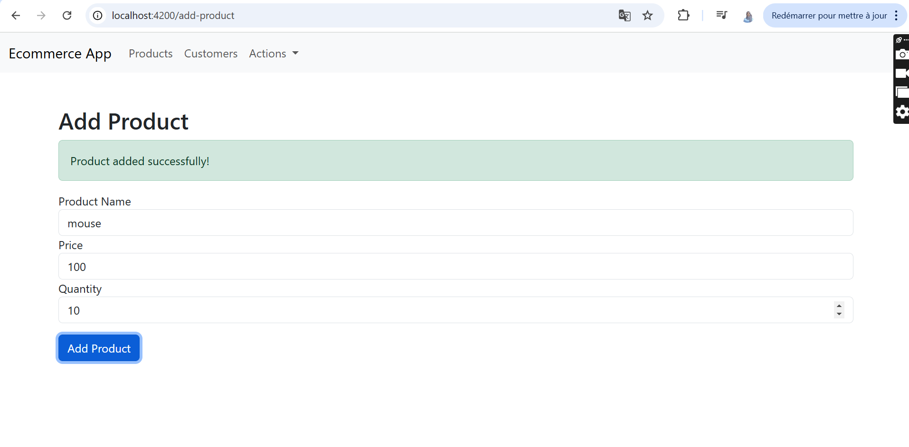
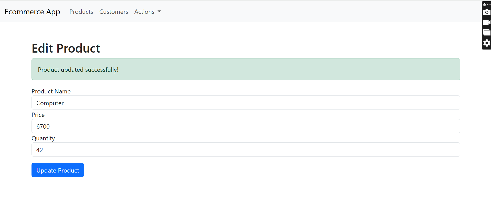
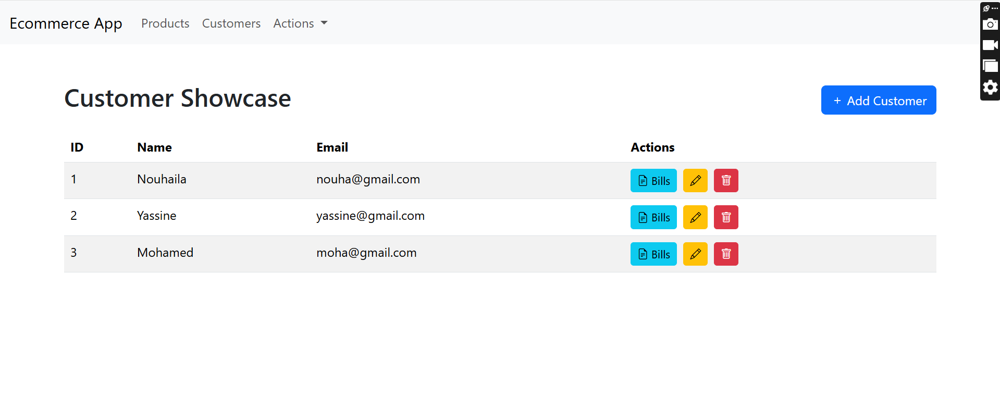
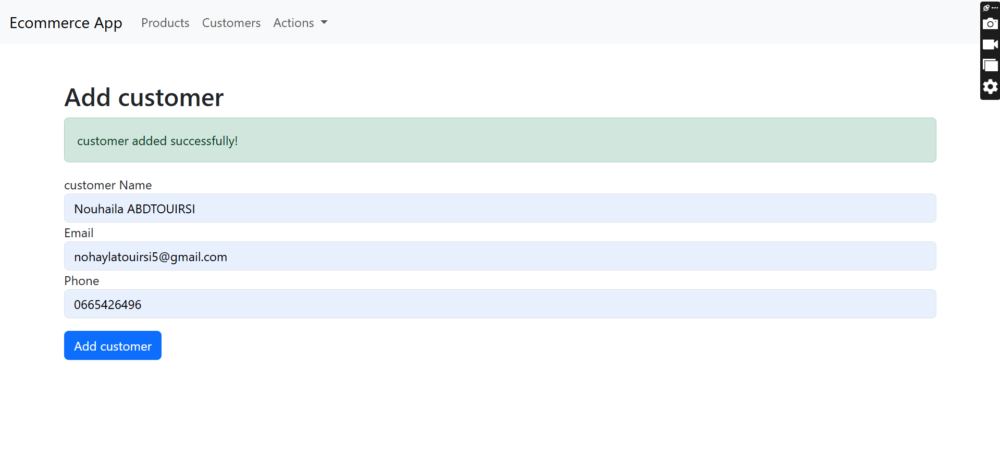

# Mise en oeuvre d'une architecture Micro-services

## 1. Use case

## 2. Contacting microservice via The Gateway
### 2.1. Inventory microservice
#### 2.1.1. Get all products

### 2.2. Customer microservice
#### 2.2.1. Get all customers

### 2.3. Registry eureka server
#### 2.3.1. Eureka server

### 2.4 Billing microservice
#### 2.4.1. Get all bills

#### 2.4.2. Get full bill by id

## 3. Angular Client
- a simple angular client to consume the microservices via the gateway and display the data in a user-friendly way.
### 3.1. Home page (List of products)
- its a simple page that displays the list of products with pagination and edit/delete actions. also it has an add product button to add a new product.

### 3.2. Add product page
- a form to add a new product.

- the edit product page is the same page that permit to add product page but with the fields filled with the product data.

### 3.3. List of customers
- a simple page that displays the list of customers with pagination and edit/delete/show bills actions. also it has an add customer button to add a new customer.

### 3.4. Customer bills
- a page that displays the list of bills of a customer with pagination.

## 3.5. Add customer page
- a form to add a new customer.
