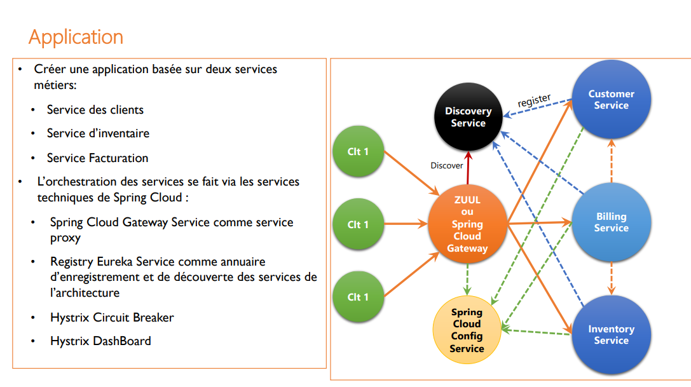
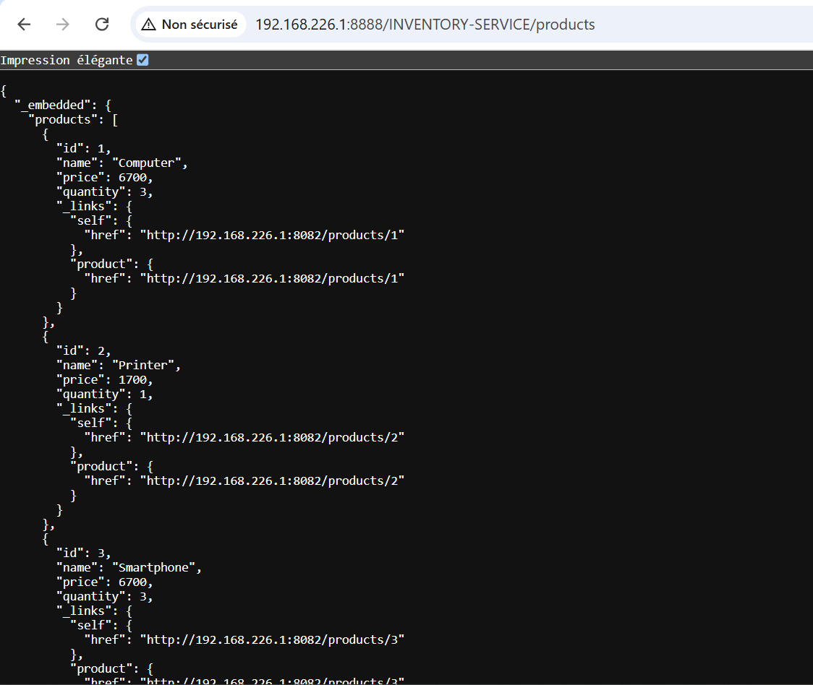
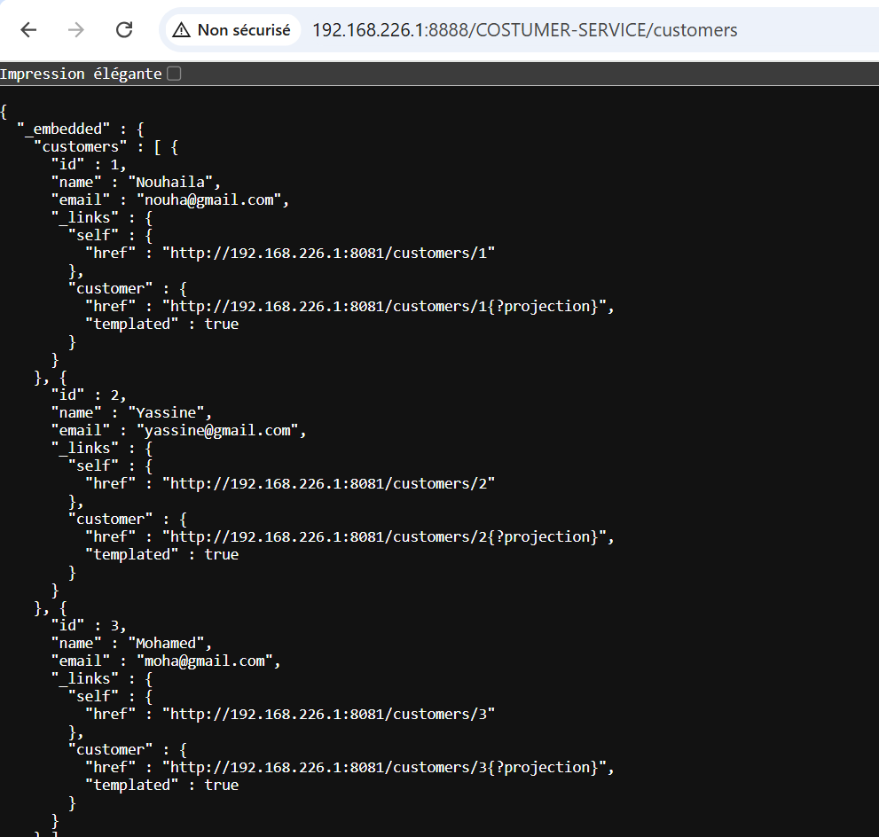
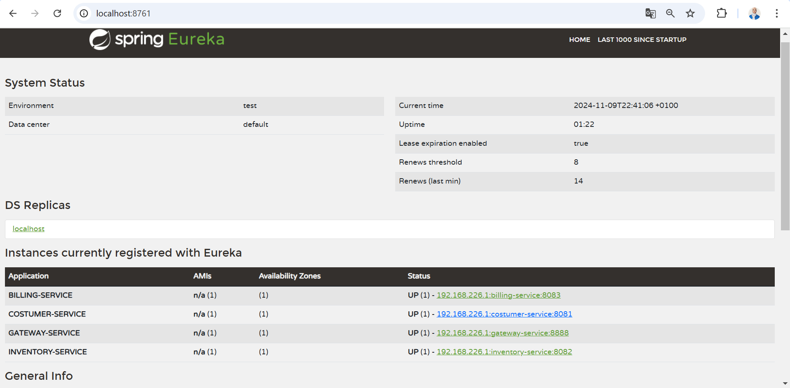
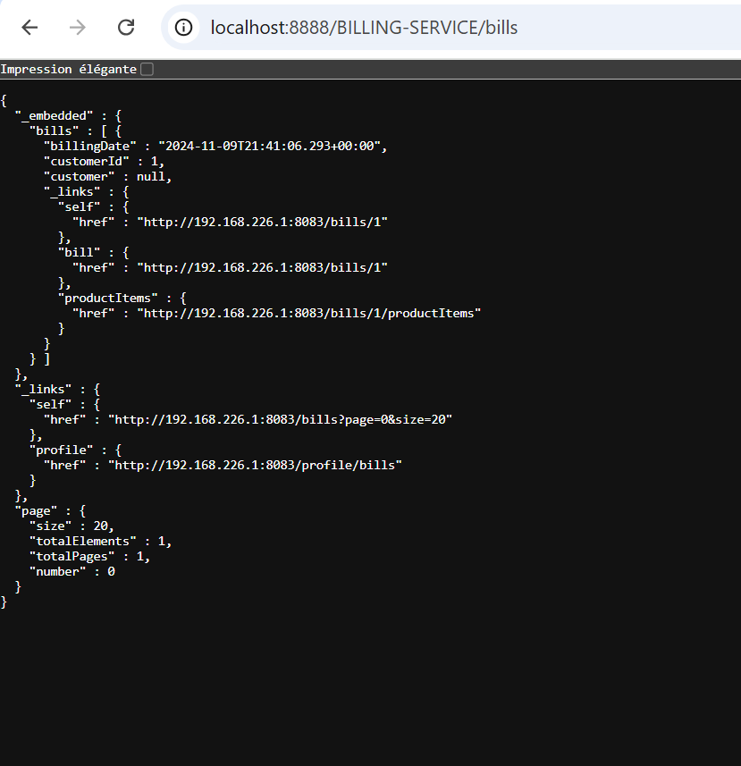
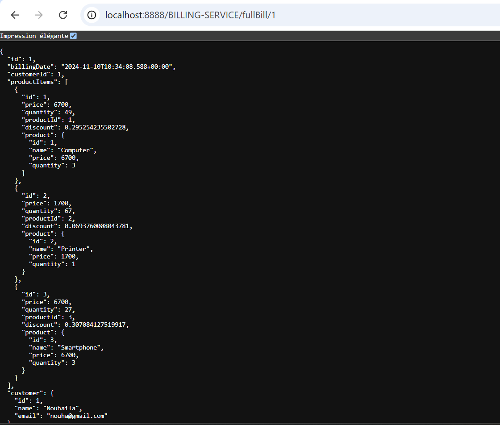

# Mise en oeuvre d'une architecture Micro-services

## 1. Use case

## 2. Contacting microservice via The Gateway
### 2.1. Inventory microservice
#### 2.1.1. Get all products

### 2.2. Customer microservice
#### 2.2.1. Get all customers

### 2.3. Registry eureka server
#### 2.3.1. Eureka server

### 2.4 Billing microservice
#### 2.4.1. Get all bills

#### 2.4.2. Get full bill by id
